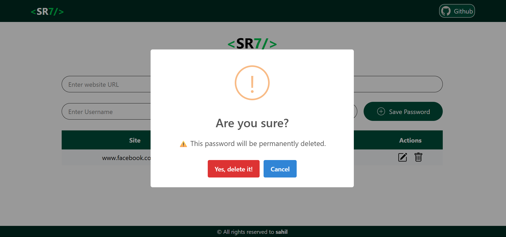

# SR7_KEEPS_MONGO

This is the full-stack version of the SR7 Keeps password manager project, featuring a Node.js/Express backend and MongoDB integration.

## Features
- Secure password management
- Modern React frontend (Vite)
- Node.js/Express backend
- MongoDB integration
- Responsive UI
- Copy, edit, and delete password entries
- Eye icon to toggle password visibility
- Beautiful icons and branding

## Project Structure
```
SR7_KEEPS_MONGO/
  backend/           # Node.js/Express backend
  public/icons/      # App icons
  public/Readme.pic/ # Images for README
  src/               # React frontend
```

## Screenshots

|  |  |
|:-------------------------------------------:|:------------------------------------------------------:|
|  |  |
|  |  |

## Getting Started

### 1. Install dependencies
#### For frontend:
```sh
npm install
```
#### For backend (in `backend`):
```sh
cd backend
npm install
```

### 2. Run the app
#### Start backend server:
```sh
node server.js
```
#### Start frontend (in another terminal):
```sh
npm run dev
```

## License
MIT

## Credits
- Developed by Sahil Rashid
- Icons and images in `public/icons` and `public/Readme.pic`

## Contact
For any queries, contact: [Your Email Here]

## More Screenshots

Below are all images from `public/Readme.pic/` for reference:

|  |  |
|:-------------------------------------------:|:------------------------------------------------------:|
|  |  |
|  |  |

> **Tip:** If images do not display on GitHub, check the file paths and ensure the images are committed to the repository.
