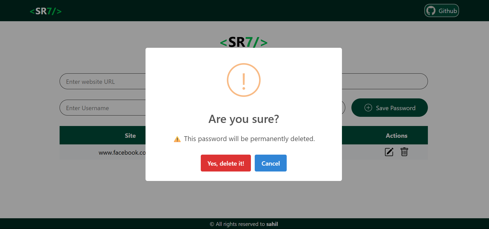

# SR7 Keeps & SR7 Keeps Mongo

SR7 Keeps is a password manager project with two main versions:
- **SR7-KEEPS**: Frontend-only version
- **SR7_KEEPS_MONGO**: Full-stack version with a Node.js/Express backend and MongoDB

---

## Features
- Secure password management
- Modern React frontend (Vite)
- Node.js/Express backend (in `SR7_KEEPS_MONGO`)
- MongoDB integration (in `SR7_KEEPS_MONGO`)
- Responsive UI
- Copy, edit, and delete password entries
- Eye icon to toggle password visibility
- Beautiful icons and branding

---

## Project Structure

```
SR7_KEEPS_MONGO/
  backend/           # Node.js/Express backend
  public/icons/      # App icons
  public/Readme.pic/ # Images for README
  src/               # React frontend
SR7-KEEPS/
  public/icons/      # App icons
  public/Readme.pic/ # Images for README
  src/               # React frontend
```

---

## Screenshots


---

## Screenshots
#### Getting started:
 
#### Add Password:
 
#### Copy Password/Website_URL/Username to Clipboard(Toast at the top showing what you copied):
 
#### Deleting the password:
 

|:----------------------------------------------------------:|:---------------------------------------------------------------:|

---

## Getting Started

### 1. Clone the repository
```sh
git clone <repo-url>
cd SR7_KEEPS_MONGO
```

### 2. Install dependencies
#### For frontend:
```sh
npm install
```
#### For backend (in `SR7_KEEPS_MONGO/backend`):
```sh
cd backend
npm install
```

### 3. Run the app
#### Start backend server:
```sh
node server.js
```
#### Start frontend (in another terminal):
```sh
npm run dev
```

---

## License
MIT

---

## Credits
- Developed by Sahil Rashid
- Icons and images in `public/icons` and `public/Readme.pic`


---


---


